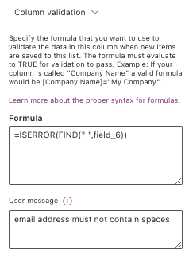
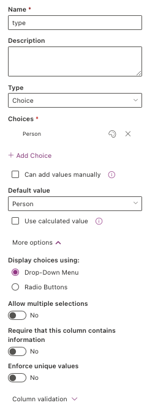
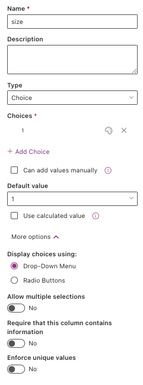
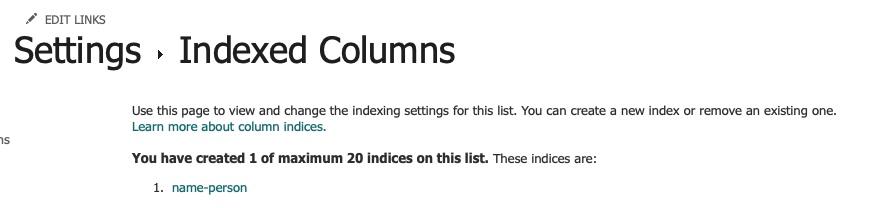
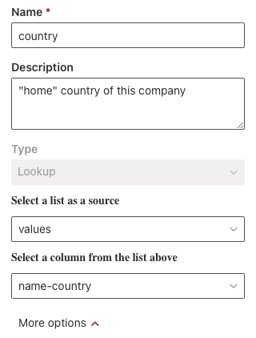
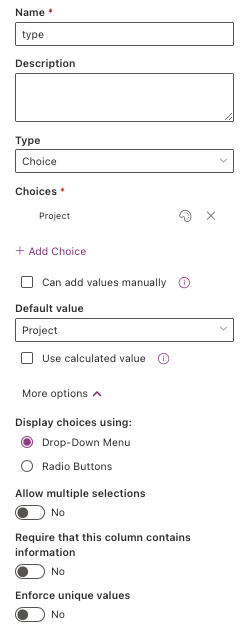

# Stakeholder mapping Sharepoint set-up
This doc shows images of the sharepoint list column (variables) created for each list used in the stakeholder mapping workflow.
Settings for each variable are shown, and in some cases brief notes about the variable. 
Some variables were repeated across multiple lists. In this case, refer to the settings provided in the people list.
Note sharepoint automatically labels the first variable created in a list "Title". This is renamed to "name-people" for the people list, "name-company" for the company list etc. 
Settings for this previously "Title" field can only be modified in the global list settings (hence the settings panels look different).
Watch out for validation formulae - these are added to ensure the data can be converted to kumu format without inducing error (e.g. "," in a name being interpretted as a cell delimeter in .csv).
Other complex calculation or validation is also changed via the global list settings.

[TOC]

## People

### Columns

<!-- 

 -->

### Settings 

#### name-person

<!--  -->

#### pronouns

<!--  -->

#### email

<!-- 
 -->

#### affiliations

<!-- 
 -->

#### position

<!--  -->

#### affiliations-turing

<!-- 
 -->

#### projects

<!-- 
 -->

#### notes

<!--  -->

#### type

<!--  -->

#### size

<!--  -->

#### github

<!--  -->

#### url

<!--  -->

#### influence-over-programme

<!--  -->

#### interest-in-programme

<!--  -->

#### how-to-engage

<!-- 
 -->

#### moe-level

<!-- 
 -->

#### consent-kumu

<!-- 
 -->

#### interaction-participant-all
- (should probably just be "interaction-all")

<!-- 
 -->

#### interaction-participant-active
- (should probably just be "interaction-active")

<!-- 
 -->

#### interaction-participant-presenter
- (should probably just be "interaction-presenter")

<!-- 
 -->

#### interaction-participant-leadership
- (should probably just be "interaction-leadership")

<!-- 
 -->

#### interactions-count
- this was meant to be a count of all inetactions they'd participated in, but I couldn't get it to work. I think I tried doing it in the code instead??

#### ID
- number
- this is a sharepoint default, forced to be unique. Can't remember how I added it...

<!--  -->

#### created
- date
- this is a sharepoint default. Can't remember how I added it...

#### modified
- date
- this is a sharepoint default. Can't remember how I added it...

#### created-by
- this is a sharepoint default. Can't remember how I added it...

#### mondified-by
- this is a sharepoint default. Can't remember how I added it...

## Companies (orgs)

### Columns

<!-- 
 -->

### Settings
- Only adding these where they are different from "people" column settings (most are replicated)

#### name-company

<!-- 
 -->

#### type

<!-- 
 -->

#### country

<!-- 
 -->

#### size

<!--  -->

#### affiliations

<!-- 
 -->

## Projects

### Columns

<!--  -->

#### additional comlumns added in DSH

<!--  -->

### Settings
- Only adding these where they are different from "people" column settings (most are replicated)

#### name-project

<!-- 
 -->

##### type

<!--  -->

#### size

<!--  -->

#### project-contact

<!-- 
 -->

#### project-funders

<!--  -->

#### data-provider
- note the look up column here "Title" is the default for the first column in a list. I've renamed this to "name-company"

<!-- 
 -->

#### data-type
- this was anticipated to be necessary for DHS, but not optimised

<!--  -->

#### delivery-stage

<!-- 
 -->

## Interactions

### Columns

<!--  -->

### Settings
- Only adding these where they are different from "people" column settings (most are replicated)
- **Note** I've not used this data in the code yet, as I hadn't figured out the most useful way to show it. I had envisioned using it to cacluate an engagement level (e.g. for Mountain of Engagement). As a result, the data captured and structure applied are not optimised.
- The main value so far has been recording who participated in what, through the look-up from the people list to this list. 

#### date-added
- This column seems redundent... Why not just use the sharepoint created date??

<!--  -->

#### type

<!--  -->

#### size

<!--  -->

#### interaction-date

<!--  -->

#### url-event

<!--  -->

#### url-notes

<!--  -->

## Values
- This list is used to denote the intended regions of primary/direct influence of a company. It should probably be renamed "geographical" or somethng ;).
- The list is dervied from a [Encyclopedia Britannica](https://www.britannica.com/topic/list-of-countries-1993160), with the addition of broader regions of "**Europe" and "**Global". Should probably add other continents or functional areas (e.g. "EMEA").

### Columns

<!--  -->

### Settings
- Only adding these where they are different from "people" column settings (most are replicated)

#### name-country

<!--  -->

